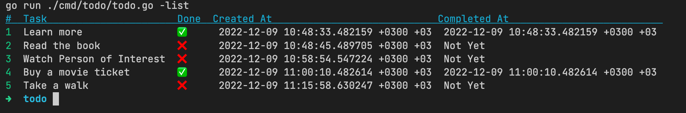

# Todo CLI (Local)

## Description

Todo is a simple, no-frills CLI based To-Do list application made in Golang
> Note: Only works with local build <br/>
> build the app with this command: `make build`

<br />

## Screenshot of Todo CLI



## Usage

### List all tasks

```bash 
./todo -list
```

### Create a task

```bash 
./todo -create Some Text about Task
```

### Complete a task

```bash 
./todo -complete 2
```

### Remove a task

```bash 
./todo -remove 2
```

<small>Last Update: 09.12.2022</small>
